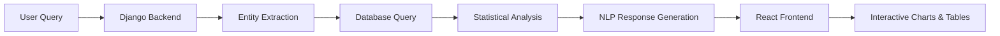

# 🏠 Real Estate Analytics Chatbot

<div align="center">

**Sigmavalue Full Stack Developer Assignment**

*An AI-powered full-stack application for analyzing real estate trends through Natural Language Querying*

[](https://sigmavalue-assignment-eight.vercel.app/)
[](https://sigmavalue-assignment-i2qy.onrender.com//api/chat/)


[View Demo](https://www.loom.com/share/e64ac185960149a78b1b972829cec538) · [Report Bug](https://github.com/yourusername/realestate-assignment/issues) · [Request Feature](https://github.com/yourusername/realestate-assignment/issues)

</div>

---

## 📑 Table of Contents

- [About The Project](#-about-the-project)
- [Key Features](#-key-features)
- [Tech Stack](#-tech-stack)
- [Demo Links](#-walkthrough-video--demo)
- [Installation](#-local-installation-guide)
- [API Documentation](#-api-documentation)
- [Project Structure](#-project-structure)
- [Author](#-author)

---

## 🎯 About The Project

This application revolutionizes real estate data analysis by enabling users to explore market trends for specific locations (Wakad, Baner, etc.) through an intuitive conversational interface.

### 🔄 How It Works



1. **User Input** — Type a natural query like *"Analyze Wakad trends"*
2. **Backend Processing** — Django extracts location entities and queries PostgreSQL
3. **Data Analysis** — Calculates weighted averages, sales volumes, and market rates
4. **Response Generation** — Returns human-readable summaries with statistical backing
5. **Visualization** — React renders interactive Chart.js visualizations

---

## ✨ Key Features

### 🤖 Natural Language Processing
- Intelligent query parsing to identify target locations
- Context-aware response generation based on real statistical data
- Human-like market summaries with actionable insights

### 📊 Interactive Data Visualization
- **Line Charts** — Correlates Average Price (₹/sqft) with Sales Volume over time
- **Dynamic Tables** — Displays granular data including:
  - Total Units Sold
  - Weighted Average Rates
  - Year-over-Year Growth

### 🎨 Professional UI/UX
- **Monochromatic Theme** — "Slate & Steel" palette for enterprise-grade aesthetics
- **Responsive Design** — Seamlessly adapts to Desktop, Tablet, and Mobile
- **Smooth Animations** — Polished micro-interactions for enhanced UX

### 🏆 Bonus Features

| Feature | Status | Description |
|---------|--------|-------------|
| 📥 **CSV Export** | ✅ Implemented | Download analysis reports in CSV format |
| ☁️ **Cloud Deployment** | ✅ Live | Frontend on Vercel, Backend on Render |
| 🔒 **API Security** | ✅ Ready | CORS configuration for production |
| 📱 **PWA Support** | 🚧 Planned | Offline-first capabilities |

---

## 🛠️ Tech Stack

<div align="center">

### Frontend


### Backend


### Deployment


</div>

---

## 🎥 Walkthrough Video & Demo

> **⚠️ Compulsory Implementation**

| Resource | Link |
|----------|------|
| 📺 **Video Demo** | [Watch on Loom/YouTube](https://www.loom.com/share/e64ac185960149a78b1b972829cec538) |
| 🚀 **Live Frontend** | [Visit App](https://sigmavalue-assignment-eight.vercel.app/) |
| ⚙️ **Backend API** | [API Docs](https://sigmavalue-assignment-i2qy.onrender.com/api/chat/) |
| 📂 **GitHub Repo** | [View Code](https://github.com/vaibhav-bhosale1/Sigmavalue-Assignment) |

---

## ⚙️ Local Installation Guide

### Prerequisites

Ensure you have the following installed:
- **Python** 3.8+ ([Download](https://www.python.org/downloads/))
- **Node.js** 16+ & npm ([Download](https://nodejs.org/))
- **Git** ([Download](https://git-scm.com/))
- **PostgreSQL** (Optional for local dev)

---

### 🔧 Backend Setup (Django)

```bash
# 1. Clone the repository
git clone https://github.com/yourusername/realestate-assignment.git
cd realestate-assignment

# 2. Create virtual environment
python -m venv venv

# 3. Activate virtual environment
# On macOS/Linux:
source venv/bin/activate
# On Windows:
venv\Scripts\activate

# 4. Install dependencies
pip install -r requirements.txt

# 5. Apply database migrations
python manage.py migrate

# 6. Load sample data (CRUCIAL STEP)
python load_csv.py

# 7. Create superuser (Optional)
python manage.py createsuperuser

# 8. Run development server
python manage.py runserver
```

✅ **Backend now running at:** `http://127.0.0.1:8000`

---

### ⚛️ Frontend Setup (React)

```bash
# 1. Navigate to frontend directory
cd frontend

# 2. Install dependencies
npm install

# 3. Create environment file
echo "REACT_APP_API_URL=http://127.0.0.1:8000" > .env

# 4. Start development server
npm start
```

✅ **Frontend now running at:** `http://localhost:3000`

---

## 📡 API Documentation

### 1️⃣ Analyze Chat Endpoint

Processes natural language queries and returns analysis data.

**Endpoint:** `POST /api/chat/`

**Request:**
```json
{
    "query": "Analyze Wakad trends"
}
```

**Response:**
```json
{
    "response": "Here is the analysis for **Wakad**. The average price is ₹9,699/sqft with 938 total sales recorded.",
    "chart_data": [
        { "year": 2023, "price": 9699, "sales": 938 },
        { "year": 2024, "price": 10234, "sales": 1042 }
    ],
    "table_data": [
        {
            "year": 2023,
            "total_units": 938,
            "avg_price": 9699,
            "total_sales_volume": "₹910 Cr"
        }
    ]
}
```

---

### 2️⃣ Download CSV Endpoint

Downloads location-specific analysis data as CSV.

**Endpoint:** `GET /api/download/?location=Wakad`

**Response:** Triggers download of `Wakad_Analysis.csv`

**CSV Format:**
```csv
Year,Total Units,Avg Price (₹/sqft),Total Sales Volume
2023,938,9699,"₹910 Cr"
2024,1042,10234,"₹1065 Cr"
```

---

## 📂 Project Structure

```
realestate-assignment/
├── backend/
│   ├── api/
│   │   ├── views.py          # API endpoints
│   │   ├── models.py         # Database models
│   │   ├── serializers.py    # DRF serializers
│   │   └── urls.py           # URL routing
│   ├── manage.py
│   ├── requirements.txt
│   └── load_csv.py           # Data loader script
│
├── frontend/
│   ├── public/
│   ├── src/
│   │   ├── components/
│   │   │   ├── ChatInterface.jsx
│   │   │   ├── ChartView.jsx
│   │   │   └── TableView.jsx
│   │   ├── App.js
│   │   ├── App.css
│   │   └── index.js
│   ├── package.json
│   └── .env
│
├── README.md
└── .gitignore
```


## 🚀 Deployment Guide

### Frontend (Vercel)

1. Push code to GitHub
2. Import project in Vercel dashboard
3. Set environment variable: `REACT_APP_API_URL=https://your-backend.onrender.com`
4. Deploy

### Backend (Render)

1. Create new Web Service on Render
2. Connect GitHub repository
3. Set build command: `pip install -r requirements.txt`
4. Set start command: `gunicorn backend.wsgi:application`
5. Add PostgreSQL database
6. Set environment variables (DATABASE_URL, SECRET_KEY, etc.)
7. Deploy

---

## 👤 Author

**[Vaibhav Bhosale]**

- 💼 LinkedIn: [Vaibhav Bhosale](https://www.linkedin.com/in/vaibhav-bhosale-0a2b13259/)
- 📧 Email: textmevaibhav@gmail.com
- 🐙 GitHub: [@vaibhav-bhosale1](https://github.com/vaibhav-bhosale1)

---

## 📝 License

This project is submitted for the **Sigmavalue Full Stack Developer Assignment**.

---

<div align="center">

**Made with ❤️ by [Your Name]**

⭐ Star this repo if you found it helpful!

</div>
